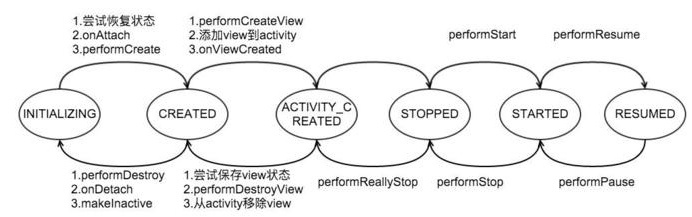

### FragmentManagerImpl  
INVALID_STATE = -1;   // Invalid state used as a null value.  
INITIALIZING = 0;     // Not yet created.  
CREATED = 1;          // Created.  
ACTIVITY_CREATED = 2; // The activity has finished its creation.  
STOPPED = 3;          // Fully created, not started.  
STARTED = 4;          // Created and started, not resumed.  
RESUMED = 5;          // Created started and resumed.  
◑ FragmentManagerImpl#dispatchCreate  
```
public void dispatchCreate() {
    mStateSaved = false;
    moveToState(Fragment.CREATED, false);
}
```
◑ FragmentManagerImpl#dispatchDestroy  
```
public void dispatchDestroy() {
    mDestroyed = true;
    execPendingActions();
    moveToState(Fragment.INITIALIZING, false);
    mActivity = null;
    mContainer = null;
    mParent = null;
}
```  
分析：  
onCreate onStart onResume;  f.mState = 1、4、5；   
onPause onStop onDestroy;  f.mState = 4、3、0；  
  

◑ FragmentManagerImpl#moveToState  
```
void moveToState(Fragment f, int newState, int transit, int transitionStyle, boolean keepActive) {
    // onAttach → onCreate → onStart → onResume  的过程 
    if (f.mState < newState) {
        switch (f.mState) {  
            // newState 是 1， f.mState 是 0 ，case 到内存重启；
            // 之前被迫 执行 onDestroy ，虽然是 内存重启了，Fragnemt 内部保存了mState，
            case Fragment.INITIALIZING:
                if (f.mSavedFragmentState != null) {
                    f.mSavedViewState = f.mSavedFragmentState.getSparseParcelableArray(FragmentManagerImpl.VIEW_STATE_TAG);
                    f.mTarget = getFragment(f.mSavedFragmentState,FragmentManagerImpl.TARGET_STATE_TAG);
                    f.mUserVisibleHint = f.mSavedFragmentState.getBoolean(FragmentManagerImpl.USER_VISIBLE_HINT_TAG, true);
                    if (!f.mUserVisibleHint) {
                        f.mDeferStart = true;
                        if (newState > Fragment.STOPPED) {
                            newState = Fragment.STOPPED;
                        }
                    }
                }
                f.mActivity = mActivity;
                f.mParentFragment = mParent;
                f.mCalled = false;
                f.onAttach(mActivity);
                if (f.mParentFragment == null) {
                    mActivity.onAttachFragment(f);
                }
                // 如果 fragment.setRetainInstance(true) 则在重启的时候，跳过 onCreate 方法
                if (!f.mRetaining) {
                    f.performCreate(f.mSavedFragmentState);
                }
                f.mRetaining = false;
                if (f.mFromLayout) {
                    f.mView = f.performCreateView(f.getLayoutInflater(f.mSavedFragmentState), null, f.mSavedFragmentState);
                    if (f.mView != null) {
                        f.mView.setSaveFromParentEnabled(false);
                        if (f.mHidden) f.mView.setVisibility(View.GONE);
                        f.onViewCreated(f.mView, f.mSavedFragmentState);
                    }
                }
            case Fragment.CREATED:
                if (newState > Fragment.CREATED) {
                    if (!f.mFromLayout) {
                        ViewGroup container = null;
                        if (f.mContainerId != 0) {
                            container = (ViewGroup)mContainer.findViewById(f.mContainerId);
                            if (container == null && !f.mRestored) {
                                throwException(new IllegalArgumentException();
                            }
                        }
                        f.mContainer = container;
                        f.mView = f.performCreateView(f.getLayoutInflater(f.mSavedFragmentState), container, f.mSavedFragmentState);
                        if (f.mView != null) {
                            f.onViewCreated(f.mView, f.mSavedFragmentState);
                        }
                    }
                    f.performActivityCreated(f.mSavedFragmentState);
                    if (f.mView != null) {
                        f.restoreViewState(f.mSavedFragmentState);
                    }
                    f.mSavedFragmentState = null;
                }
            case Fragment.ACTIVITY_CREATED:
            case Fragment.STOPPED:
                if (newState > Fragment.STOPPED) {
                    f.performStart();
                }
            case Fragment.STARTED:
                if (newState > Fragment.STARTED) {
                    f.mResumed = true;
                    f.performResume();
                    f.mSavedFragmentState = null;
                    f.mSavedViewState = null;
                }
        }
    } else if (f.mState > newState) {
        // onResume → onPause → onStop → onDestroy的过程
        switch (f.mState) {
            case Fragment.RESUMED:
                if (newState < Fragment.RESUMED) {
                    f.performPause();
                    f.mResumed = false;
                }
            case Fragment.STARTED:
                if (newState < Fragment.STARTED) {
                    f.performStop();
                }
            case Fragment.STOPPED:
            case Fragment.ACTIVITY_CREATED:
                if (newState < Fragment.ACTIVITY_CREATED) {
                    if (f.mView != null) {
                        if (!mActivity.isFinishing() && f.mSavedViewState == null) {
                            saveFragmentViewState(f);
                        }
                    }
                    f.performDestroyView();
                }
            case Fragment.CREATED:
                if (newState < Fragment.CREATED) {
                    if (f.mAnimatingAway != null) {
                        f.mStateAfterAnimating = newState;
                        newState = Fragment.CREATED;
                    } else {
                        if (!f.mRetaining) {
                            f.performDestroy();
                        }
                        f.mCalled = false;
                        f.onDetach();
                        if (!f.mCalled) {
                            throw new SuperNotCalledException();
                        }
                        if (!keepActive) {
                            if (!f.mRetaining) {
                                makeInactive(f);
                            } else {
                                f.mActivity = null;
                                f.mParentFragment = null;
                                f.mFragmentManager = null;
                                f.mChildFragmentManager = null;
                            }
                        }
                    }
                }
        }
    }
    f.mState = newState;
}
```

