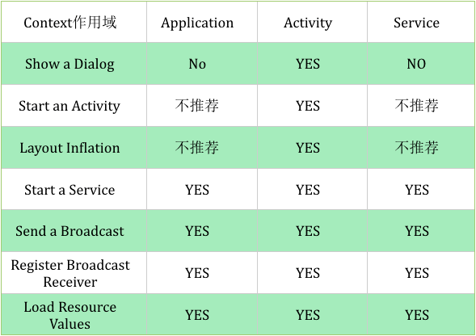

#### 对Context的认识  
Application、Service 中的Context，即getApplicationContext，被当作应用；  
Activity中的Context，即activity.this，被当作视图；  
Context是一个抽象类，类继承结构图：  
```
Context;    
    ContextImpl;  
    ContextWrapper;  
        Application;  
        Service;  
        ContextThemeWrapper;  
            Activity;  
```
具体的context的功能都是ContextImpl去实现的；  


#### 在 Activity、Service中   

getApplication();  
getApplicationContext();  
getBaseContext();  
其中，getApplication  与 getApplicationContext 是同一个对象，都是Application的引用；   
getBaseContext 得到的是 ContextImpl的引用；  

#### 在Fragment中  

getContext();  
getActivity();  

#### 在ContentProvider中

getContext();  

#### 在BroadcastReceiver中
```
public void onReceive(Context context, Intent intent) {
    context.getApplicationContext();
}
```
 

  


