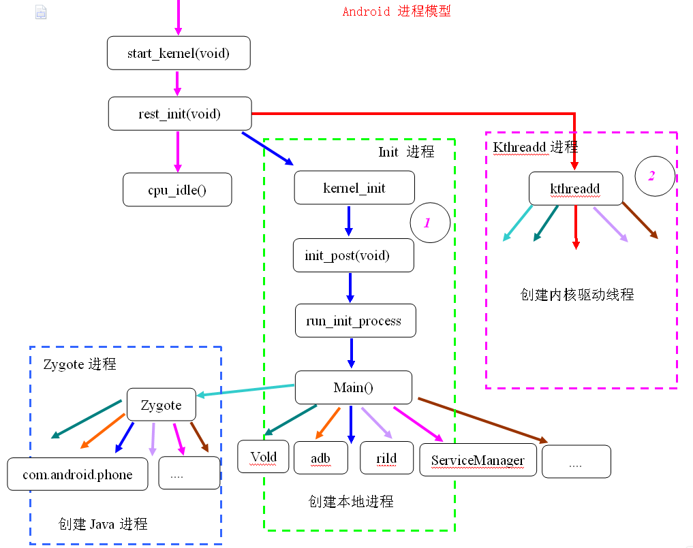

#### 当按下电源键  

cpu上电，运行0xFFF0地址的4k程序，4k程序将bootloader程序搬运到ram中运行，bootloader负责初始化硬件资源和加载kernel，然后将控制权交给kernel。    
linux kernel得到控制权后，开始自启。第一个执行的函数是start_kernel；  
start_kernel中调用下列一系列函数：  

page_address_init();//页表地址初始化   
sched_init();   
page_alloc_init();//内存分配初始化，请看mmu和内存管理   
init_IRQ();//中断向量初始化   
softirq_init();//软中断初始化   
console_init();//终端初始化   
calibrate_delay();   
vfs_caches_init();//虚拟文件系统(vfs)初始化   
rest_init();//这就是最后创建init0进程的函数，init0进程会创建android的受精卵进程Zygote。  

  

> 参考 

http://blog.csdn.net/mr_zhaojy/article/details/52776254  
 

