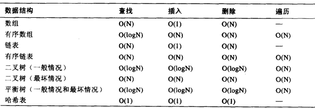
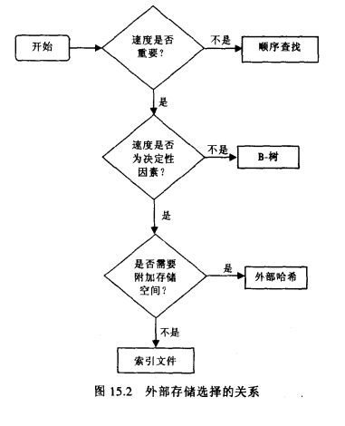

###### 数据结构

> 关键字

数据 （data）、数据元素 （data element）、关键字 （key）、主关键字（primary key）
数据结构 （data structure）

> 基本概念

数据结构是指，存在一种或多种特定关系的数据元素的集合，是指数据元素之间存在的关系， 包括如下几个概念：

- 数据的逻辑结构
1. 线性结构：数据元素只有一个前驱数据元素和一个后继数据元素。
2. 树结构：每个数据元素只有一个前驱数据元素，可有零个或若干个后继数据元素。
3. 图结构：每个数据元素可有零个或若干个前驱数据元素，零个或若干个后继数据元素。

- 数据的存储结构
1. 顺序存储结构
顺序存储就是把数据存储在一块连续的存储介质上，数组就是典型的顺序存储；
2. 非顺序存储结构
非顺序存储就是各个数据不一定存在一个连续的存储介质上，链表就是典型的非顺序存储；

- 数据操作
1. 初始化。
2. 判断是否空状态。
3. 存取，指获得、设置指定元素值。
4. 统计数据元素个数。
5. 遍历（traverse），指按照某种次序访问一个数据结构中的所有元素，并且每个数据元素只被访问一次。遍历一种数据结构，将得到一个所有数据元素的线性序列。
6. 插入（insert）、删除（remove）指定元素。
7. 查找（search），指在数据结构中寻找满足给定条件的数据元素。
8. 排序（sort），指对数据元素按照指定关键字值的大小递增（或递减）次序重新排列。

> 数据结构横向比较

- 有序数组：
查找、更新最快;
插入和删除慢, 比如插入数组时候需要移动其后面的值，效率低；
大小受限，固定；

- 链表：
查找、更新较慢;
插入和删除最快；
大小不受限；

- 二叉树  

- 平衡树  

- 二叉搜索树  

-  最优二叉树

- AVL树  

- 红黑树

  

  

  

