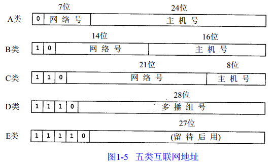

### Internet Protocol  
IP  Internet Protocol  因特网互联协议（网络层）；  
IP不是可靠的协议，IP协议没有提供一种数据未传达以后的处理机制；  
IP 协议的作用是把各种数据包传送给对方。 而要保证确实传送到对方那里，则需要满足各类条件。  
其中两个重要的条件是 IP 地址和 MAC地址（Media Access Control Address）。  
[IP路由选择](library/IP_Router.md)   
  
A类 范围 0.0.0.0 到 127.255.255.255；私有地址 10.0.0.0到10.255.255.255；保留地址 127.0.0.0到127.255.255.255，0.0.0.0到0.255.255.255    
B类 范围 128.0.0.0 到 191.255.255.255；私有地址 172.16.0.0到172.31.255.255；保留地址 169.254.0.0到169.254.255.255；  
C类 范围 192.0.0.0 到 223.255.255.255；私有地址 192.168.0.0到192.168.255.255；  
D类 范围 224.0.0.0 到 239.255.255.255；专用地址 224.0.0.0-224.0.0.255；公用地址 224.0.1.0-238.255.255.255；私有地址 239.0.0.0-239.255.255.255；    
E类 范围 240.0.0.1 到 255.255.255.254；  

