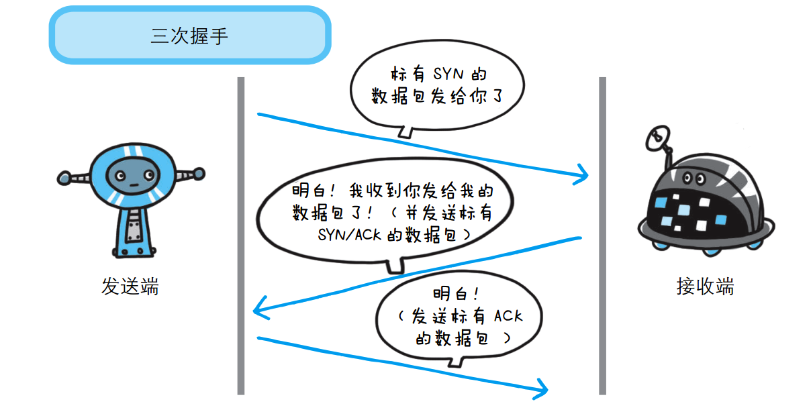

### TCP  

TCP  Transmission Control Protocol  传输控制协议（传输层）  
TCP是面向连接的通信协议，通过三次握手建立连接，通讯完成时要拆除连接，由于TCP是面向连接的所以只能用于端到端的通讯。  
TCP 位于传输层，提供可靠的字节流服务。  
◆ 字节流服务  
所谓的字节流服务（Byte Stream Service）是指，为了方便传输，将大块数据分割成以报文段（segment）为单位的数据包进行管理。  
TCP 协议为了更容易传送大数据才把数据分割， 而且 TCP 协议能够确认数据最终是否送达到对方。  

◆ 确保数据能到达目标  
为了准确无误地将数据送达目标处， TCP 协议采用了三次握手（three-way handshaking）策略。  
用 TCP 协议把数据包送出去后， TCP不会对传送后的情况置之不理， 它一定会向对方确认是否成功送达。  
握手过程中使用了 TCP 的标志（flag）——SYN（synchronize）和 ACK（acknowledgement）。  

### 三次握手  
♬客户端（发送端）首先发送一个带 SYN 标志的数据包给服务端（接收端），并等待服务端确认；  
♬服务端收到后，回传一个带有 SYN/ACK 标志的数据包以示传达确认信息，服务端进入等待接收状态；  
♬最后，客户端收到SYN/ACK报文，再回传一个带 ACK 标志的数据包，代表“握手”结束。  
若在握手过程中某个阶段莫名中断， TCP 协议会再次以相同的顺序发送相同的数据包。  
  

### 四次挥手  
♬客户端发送一个FIN，用来关闭客户端到服务端的数据传送，客户端进入FIN_WAIT_1状态。  
♬服务端收到FIN后，发送一个ACK给客户端，服务端进入CLOSE_WAIT状态；  
♬服务端发送一个FIN，用来关闭服务端到客户端的数据传送，服务端进入LAST_ACK状态。  
♬客户端收到FIN后，客户端进入TIME_WAIT状态，接着发送一个ACK给服务端，服务端进入CLOSED状态；  
     2MSL后，客户端没有收到报文，代表服务端已经关闭，客户端也要进入CLOSED状态；       

#### MSL  
MSL是Maximum Segment Lifetime英文的缩写，中文可以译为“报文最大生存时间”，他是任何报文在网络上存在的最长时间，超过这个时间报文将被丢弃。      
RFC 793 [Postel 1981c] 指出MSL为2分钟。然而，实现中的常用值是30秒，1分钟，或2分钟。  

#### 为什么上图中的A在TIME-WAIT状态必须等待2MSL时间呢？   
♬ 第一，为了保证A发送的最后一个ACK报文能够到达B。这个ACK报文段有可能丢失，因而使处在LAST-ACK状态的B收不到对已发送的FIN+ACK报文段的确认。  
B会超时重传这个FIN+ACK报文段，而A就能在2MSL时间内收到这个重传的FIN+ACK报文段。  
如果A在TIME-WAIT状态不等待一段时间，而是在发送完ACK报文段后就立即释放连接，就无法收到B重传的FIN+ACK报文段，因而也不会再发送一次确认报文段。  
这样，B就无法按照正常的步骤进入CLOSED状态。 
♬ 第二，A在发送完ACK报文段后，再经过2MSL时间，就可以使本连接持续的时间所产生的所有报文段都从网络中消失。这样就可以使下一个新的连接中不会出现这种旧的连接请求的报文段。  
 