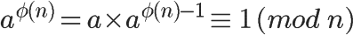

#### 模反元素  

如果两个正整数a和n互质，那么一定可以找到整数b，使得 ab-1 被n整除，或者说ab被n除的余数是1。  
    
这时，b就叫做a的"模反元素"。  
比如，3和11互质，那么3的模反元素就是4，因为 (3 × 4)-1 可以被11整除。显然，模反元素不止一个，  
 4加减11的整数倍都是3的模反元素 {...,-18,-7,4,15,26,...}，即如果b是a的模反元素，则 b+kn 都是a的模反元素。  
欧拉定理可以用来证明模反元素必然存在。  
    
可以看到，a的 φ(n)-1 次方，就是a的模反元素。  
好了，需要用到的数学工具，全部介绍完了。RSA算法涉及的数学知识，就是上面这些，下一次我就来介绍公钥和私钥到底是怎么生成的。  
