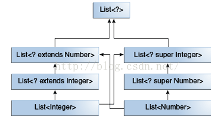

### Java泛型  

基本概念： 泛型类， 泛型方法，   

◆ 好处  
避免了类型强转操作；  
避免一些方法重载；  

◆ 通配符  
? extends Number  可以接受Number以及其的子类，称为上限通配符；   
? super  Number  可以接受Number以及其的父类，称为下限通配符；   
? 只有一个?，代表无限定通配符，例如Class<?>方法；  

上限通配符、下限通配符、无限定通配符之间的关系：  
  

◆ in与out  
// in 逆变  超类  
// out 协变 子类  
// 不变    

◆ 类型擦除  
将没有限定的类型参数用Object替换，保证class文件中只含有正常的类、接口与方法；  
在必要的时候进行类型转换，保证类型安全；  
在泛型的继承上使用桥接方法（bridge methods）保持多态性。  

◆ 参考  
http://blog.csdn.net/u012152619/article/details/47253811  
