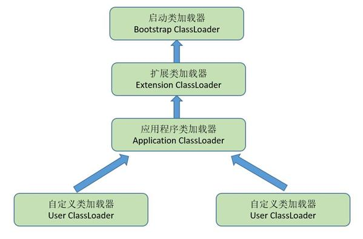

###### ClassLoader  

> JVM存在两种不同的类加载器，  

一种是 启动类加载器（Bootstrap Classloader），这个类加载器使用C++语言实现，是JVM自身的一部分；  
一种是 其他类加载器，这些类加载器都是Java语言实现的，独立于JVM之外，并且全部继承于 ClassLoader ；  

> 常用类加载器  

启动类加载器（Bootstrap ClassLoader）  这个类 加载 放在JAVA_HOME/lib 下的class文件；  
扩展类加载器（Extension ClassLoader）这个加载器由 sun.misc.Launcher$ExtClassLoader实现，负责加载 放在JAVA_HOME\lib\ext 下的class文件；  
应用程序类加载器（Application ClassLoader）这个类加载器由 sun.misc.Launcher$AppClassLoader 实现，  
负责加载ClassPath上所指定的class文件，如果开发者没有指定类加载器，那么默认就是使用这个类加载器，  

  

> 双亲委派模型的工作过程  

如果一个类加载器收到了类加载的请求，它首先不会自己去尝试加载这个类，而是把这个请求委派给父类加载器去完成，    
每一个层次的类加载器都是如此，因此所有的加载请求最终都应该传送到顶层的启动类加载器中，  
只有当父加载器反馈自己无法完成这个加载请求时，子加载器才会尝试自己去加载。  

