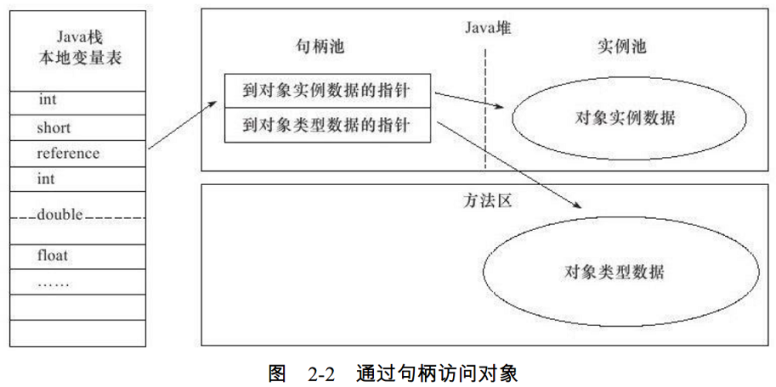

### 对象的访问定位  
在Java栈（Java虚拟内存栈）的本地变量表中存储，对象的引用；而对象的访问形式取决于虚拟机的实现方式，  
目前主流的访问方式分为两种，使用句柄 和 直接指针 两种。  

◆ 句柄访问方式  
Java堆会划分出一块内存，用来作为句柄池，对象引用中存储着 对象的句柄池 的地址，  
而对象句柄中，包含了对象实例数据的指针、对象类型数据的指针。  
  

◆ 直接指针访问  
Java堆对象的布局中就必须考虑如何放置访问类型数据的相关信息，而对象引用中存储的直接就是对象地址  
  

◆ 二者比较  
这两种对象访问方式各有优势，使用句柄来访问的最大好处就是，  
reference中存储的是，稳定的句柄地址，在对象被移动（垃圾收集时移动对象是非常普遍的行为）时，  
只会改变句柄中的实例数据指针，而reference本身不需要修改。  
使用直接指针访问方式的最大好处就是速度更快，它节省了一次指针定位的时间开销，  
由于对象的访问在Java中非常频繁，因此这类开销积少成多后也是一项非常可观的执行成本。  
就本书讨论的主要虚拟机Sun HotSpot而言，它是使用第二种方式进行对象访问的，  
但从整个软件开发的范围来看，各种语言和框架使用句柄来访问的情况也十分常见。  

  