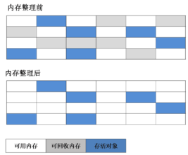
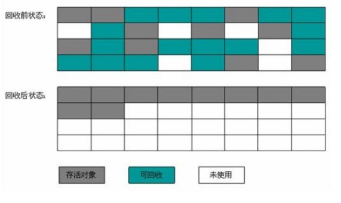
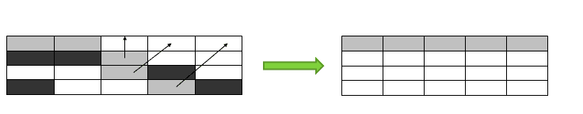

### 垃圾收集算法

标记-清除算法、标记-整理算法、复制算法、分代收集算法   

◆ 标记-清除算法  
最基础的收集算法是“标记-清除”（Mark-Sweep）算法，如同它的名字一样，算法分为“标记”和“清除”两个阶段。  
首先标记出所有需要回收的对象 ，在标记完成后统一回收所有被标记的对象。  
不足：  
效率问题：标记和清除两个过程的效率都不高  
空间问题：标记清除之后产生大量不连续的内存碎片，空间碎片太多可能会导致以后程序运行过程中需要分配较大对象时，
无法找到足够的连续内存而不得不提前触发另一次垃圾收集动作。  

  

◆ 标记-整理算法  
复制收集算法在对象存活率较高时，就要进行较多的复制操作，效率就会变低。 根据老年代的特点，提出了”标记-整理“算法。   
标记过程仍然与”标记-清除“算法一样，但后续步骤不是直接对可回收对象进行清理，而是让所有存活的对象都向一端移动，然后直接清理掉边界以外的内存。  

  
  
◆ 复制算法  
目的：为了解决效率问题。  
将可用内存按容量大小划分为大小相等的两块，每次只使用其中的一块。当一块内存使用完了，就将还存活着的对象复制到另一块上面，  
然后再把已使用过的内存空间一次清理掉。这样使得每次都是对整个半区进行内存回收，内存分配时也就不用考虑内存碎片等复杂情况。
缺点：将内存缩小为了原来的一半。  

  

现代的商业虚拟机都采用这种收集算法来回收新生代，IBM公司的专门研究表明，新生代中对象98%对象是“朝生夕死”的，  
所以不需要按照1：1的比例来划分内存空间，而是将内存分为较大的Eden空间和两块较小的Survivor空间，每次使用Eden和其中一块Survivor。  
HotSpot虚拟机中默认Eden和Survivor的大小比例是8：1。  

[分代收集算法](GC_Garbage_Collector_Generation.md)    

一般是把Java堆分为新生代和老年代，这样就可以根据各个年代的特点采用最适当的收集算法。  
在新生代中，每次垃圾收集时都发现有大批对象死去，只有少量存活，那就选用复制算法。  
在老年代中，因为对象存活率高、没有额外空间对它进行分配担保，就必须采用“标记-清除”或“标记-整理”算法来进行回收。  

◆ 参考  
http://www.importnew.com/26821.html  
