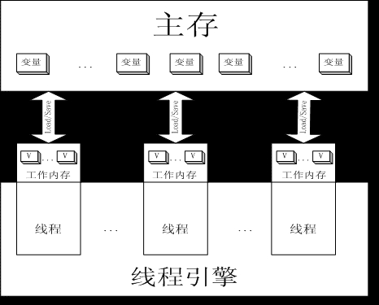

###### 基本概念

JMM定义了线程和主存之间的抽象关系；  

> 什么是内存模型  

内存模型描述了程序中各个变量（实例域、静态域和数组元素）之间的关系，以及在实际计算机系统中将变量存储到内存和从内存中取出变量这样的底层细节，  
对象最终是存储在内存里面的，这点没有错，但是编译器、运行库、处理器或者系统缓存可以有特权在变量指定内存位置存储或者取出变量的值。  
【JMM】（Java Memory Model的缩写）允许编译器和缓存以数据在处理器特定的缓存（或寄存器）和主存之间移动的次序拥有重要的特权，  
除非程序员使用了final或synchronized明确请求了某些可见性的保证。  

> Java内存模型的目的

屏蔽掉各种硬件和操作系统的内存访问差异，以实现让java程序在各种平台下都能达到一致的内存访问效果。  
定义程序中各个变量的访问规则，即在虚拟机中将变量存储到内存和从内存中取出变量这样的底层细节。  
此处的变量与Java变成中所说的变量是有所区别，它包括了实例字段，静态字段和构成数组对象的元素，但不包括局部变量和方法参数。  

> JMM 结构 的介绍

JVM中存在一个主存（Main Memory 或 Java Heap Memory），Java中所有的变量都会存在内存中的，对于所有线程进行共享，  
而每个线程有存在自己的 工作内存（Working Memory），工作内存中保存的是主存中某些变量的备份，线程对所有变量的操作并非发生在主存中，  
而是发生在工作内存中，线程之间不能直接访问工作内存，变量在程序中的传递，是依赖主存完成的；  
在当今多核处理器中，大部分数据存储在 高速缓存中；
synchronized 和 volatile 关键字提供内存模型中的可见性，是使用一些特殊指令来刷新缓存，刷新硬件缓存 延时执行功能操作，无疑会对程序的性能产生一点的影响；  

  

> 异步 与 同步  

- 同步  
同步就是在发出一个功能调用的时候，在没有得到响应之前，该调用就不返回；  

- 异步  
异步就是在发出一个功能调用的时候，不需要等待响应，继续进行该做的事情，一旦得到了响应 会给出响应的处理；  

> 可见性（visibility）  

如果使用 synchronized 关键字同步语句块，这种情况下，执行程序所独有的某些内存是独立模式的，其他线程是不能对其所占的内存进行访问的，这种情况称为内存不可见；  
JMM在默认情况下不会处理各个线程对同一内存区域的可见性，因此需要去手动实现；  
JMM内存模型里面，通过并发线程修改全局变量的时候，必须将变量同步到内存后，其他线程才能正确访问到；  

> [原子性（atomicity）](jmm_basic_concept_atomicity.md)    

JMM的原子性有一个规则，如果在读取一个变量时，这个数值是由某一个其他线程写入，而不是由其他多个线程并发写入，这个时候，JVM本身不需要关心数据是来自什么线程；  
原子性就是原子级别的操作，比如最小内存块的读写操作，可以理解为native的读写操作；  

> 可排序性  

排序性主要围绕 读写语句有关的序列，如果在该模型内部使用了 一致的同步性 的时候，这些属性都会遵循比较简单的原则：  
每个同步块内的任何变化都具备了原子性以及可见性，每个同步块都有一个独立空间 以及独立的同步控制器 和 锁机制，  
然后对外按照JVM的执行指令进行数据的读写操作，使得使用内存的过程变得非常严谨。  

>  关于主内存与工作内存之间具体的交互协议  

即一个变量如何从主内存拷贝到工作内存、如何从工作内存同步回主内存之类的实现细节，Java内存模型中定义了8种操作来完成，并且每种操作都是原子的、不可再分的。

###### 八种操作：

lock：作用于主内存的变量，把一个变量标识为一条线程独占的状态；  
unlock：作用于主内存的变量，把一个处于锁定状态的变量释放出来；  
read：把一个变量的值从主内存传输到工作内存中，以便随后的load使用；  
load：把read操作从主内存中得到的变量值放入到工作内存的变量副本中；  
use：把工作内存中一个变量的值传递给执行引擎，每当虚拟机遇到一个需要使用变量的值的字节码指令时将会执行这个操作；  
assign：把一个从执行引擎中接收到的值赋值给工作内存中的变量，每当虚拟机遇到一个给变量赋值的字节码指令时执行这个操作；  
store：把工作内存中的一个变量的值传递到主内存，以便随后的write使用；  
write：把store操作从工作内存中得到的变量值放入到主内存的变量中；  

> 参考  

- Java内存模型  
http://www.cnblogs.com/BangQ/p/4045954.html  

- https://github.com/LRH1993/android_interview/blob/master/java/concurrence/volatile.md  

