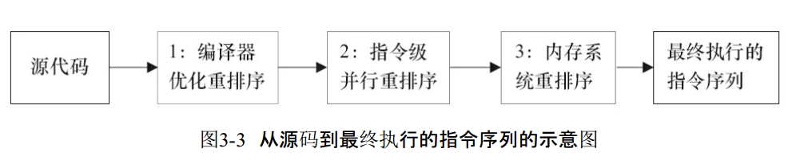

###  指令排序  

int a = 10;    //语句1  
int r = 2;    //语句2  
a = a + 3;    //语句3  
r = a*a;     //语句4  

这个时候会指令排序吗？  
当然不会了， 因为 他们有相互依赖的关系，质量排序，只是机器优化，提高运行效率，并不会改变其运行结果；  

在执行程序时，为了提高性能，编译器和处理器常常会对指令做重排序  
1）编译器优化的重排序。编译器在不改变单线程程序语义的前提下，可以重新安排语句的执行顺序。  
2）指令级并行的重排序。现代处理器采用了指令级并行技术来将多条指令重叠执行。如果不存在数据依赖性，处理器可以改变语句对应机器指令的执行顺序。  
3）内存系统的重排序。由于处理器使用缓存和读/写缓冲区，这使得加载和存储操作看上去可能是在乱序执行。  

  

◆ as-if-serial语义  
不管怎么重排序（编译器和处理器为了提高并行度），（单线程）程序的执行结果不能被改变。  
编译器、runtime和处理器都必须遵守as-if-serial语义。  
为了遵守as-if-serial语义，编译器和处理器不会对存在数据依赖关系的操作做重排序，因为这种重排序会改变执行结果。  
但是，如果操作之间不存在数据依赖关系，这些操作就可能被编译器和处理器重排序。  
